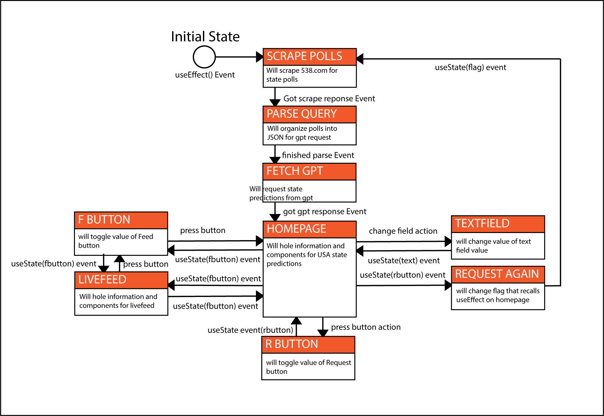

# Election Predictor 2024

## Project Overview
This project is a web application built with Next.js and TypeScript that predicts the winner of the 2024 U.S. Presidential Election. It scrapes polling data from various sources and utilizes OpenAI's API for data evaluation and prediction analysis.

## System Architecture

### Structure and Algorithms
The system is structured around a modular Next.js framework that facilitates the integration of frontend components with backend services seamlessly. Key algorithms include:
- **Data Scraping Algorithm**: Custom scripts that periodically fetch the latest polling data from specified sources.
- **Data Evaluation Algorithm**: Utilizes OpenAI's API to analyze trends and predict outcomes based on historical data comparisons.

### UML Class Diagram

This diagram provides a visual representation of the classes and their relationships within the system.

### System Statechart Diagrams


Statechart diagrams illustrate the various states within the application, from data scraping to prediction output.

## Development and Testing

### Acceptance Test Cases
The execution of acceptance test cases is documented through detailed screenshots showcasing the interaction with the system. Each step corresponds to a specific test case scenario.

#### Test Case Example
1. **Start Test**: User accesses the prediction page.
2. **Data Retrieval**: System fetches the latest data.
3. **Prediction Display**: The prediction results are displayed to the user.

Screenshots:


### Git Repository Network


This diagram shows the branch and commit history, illustrating the development workflow and contributions.

## Installation and Setup
Instructions for setting up the project locally:
```bash
git clone https://github.com/yourrepository/election-predictor-2024.git
cd election-predictor-2024
npm install
npm run dev
